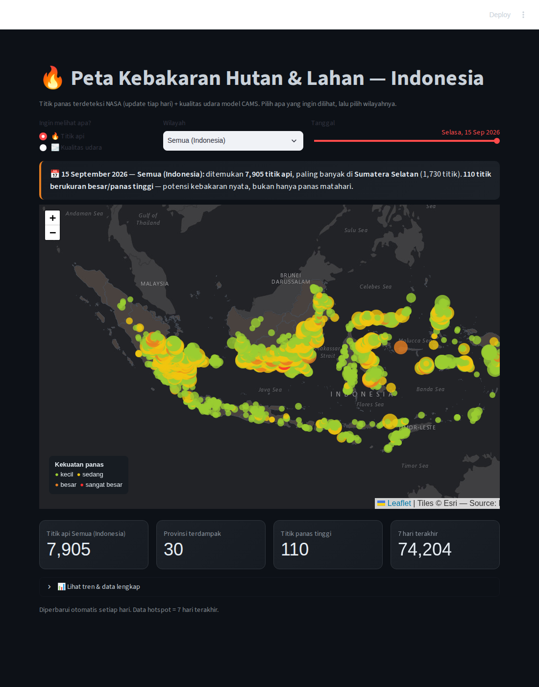
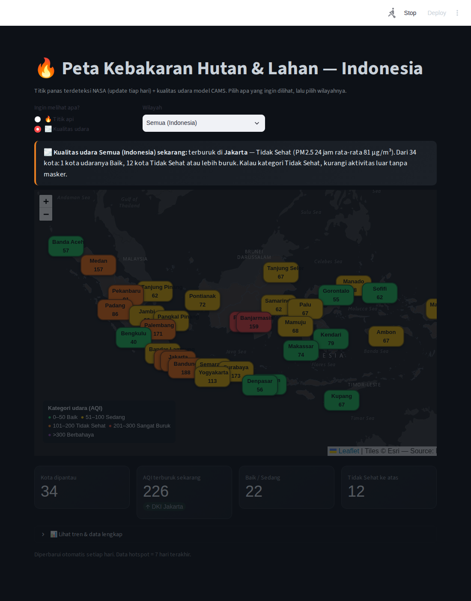
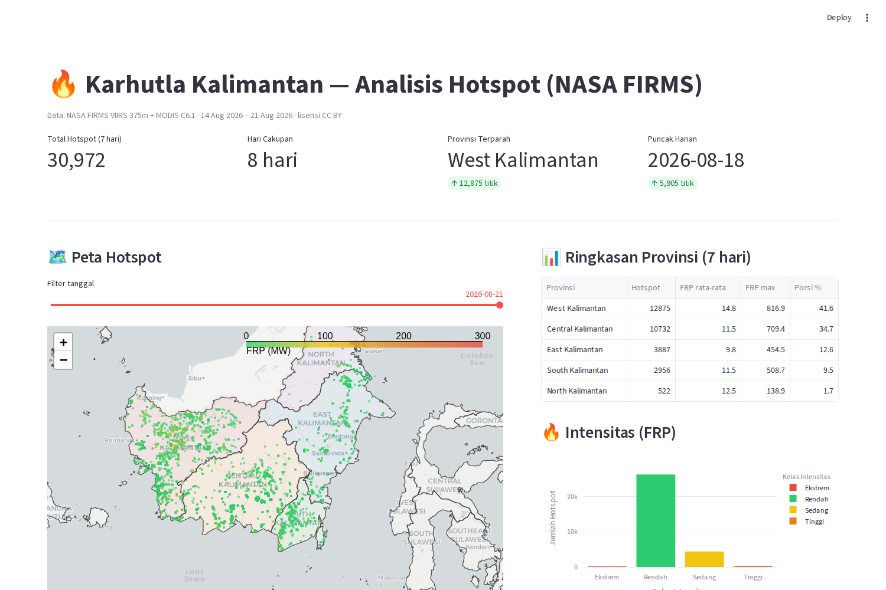
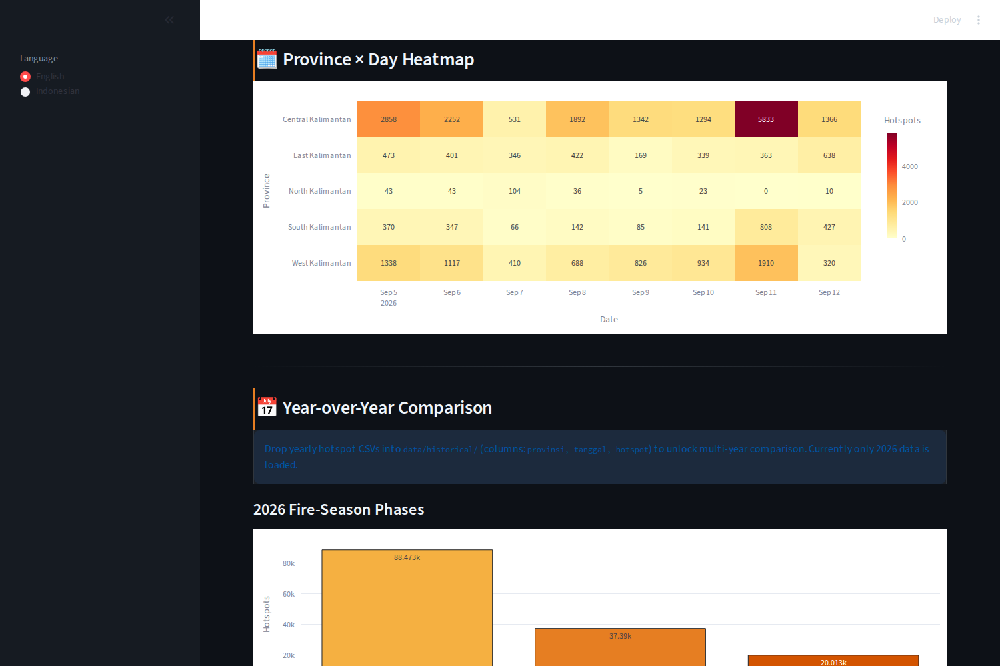
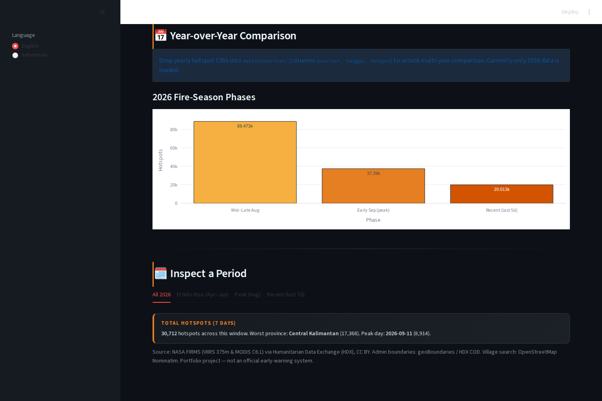

# 🔥 Karhutla Indonesia — Analisis Hotspot Kebakaran & Kualitas Udara (NASA FIRMS + CAMS)

> 📖 [English](README.md) · [Bahasa Indonesia](README.id.md)

Analisis data end-to-end **deteksi titik panas (hotspot) kebakaran hutan & lahan di
seluruh Indonesia** dari NASA FIRMS (VIIRS 375m + MODIS C6.1), ditarik **tanpa kunci
API** lewat mirror Humanitarian Data Exchange (HDX), digabung dengan **kualitas udara
(PM2.5 / AQI) 34 ibu kota provinsi** dari model Copernicus CAMS (API gratis Open-Meteo).
Dibangun sebagai proyek portofolio data analyst: data asli, cerita bahasa manusia,
pipeline harian yang bisa direproduksi, dan **dashboard berbasis peta yang bisa dibaca
orang awam**.

**Jendela data:** rolling 7 hari, diperbarui otomatis tiap hari · **±74.000 hotspot**
tersimpan · **34 kota** dipantau kualitas udaranya (kategori ISPU, label Bahasa).

### 📸 Dashboard (map-centric, ramah orang awam)

|  |
|:--:|
| *Layer "🔥 Titik api": peta Esri gelap, titik api agregat grid dengan warna/ukuran sesuai kekuatan panas (FRP) + legenda, ringkasan bahasa manusia per hari, pemilih pulau, slider tanggal* |

|  |
|:--:|
| *Layer "🌫️ Kualitas udara": marker 34 kota berwarna sesuai kategori ISPU, saran kesehatan bahasa sederhana, legenda ISPU* |

|  |  |
|:--:|:--:|
| *Tren harian dengan MA mingguan + pita risiko kebakaran; distribusi FRP; peringkat provinsi* | *Heatmap mingguan × bulan dengan tab "Pilih Periode" (Semua 2026 / Naik El Niño / Puncak Agt / Terbaru)* |

|  |
|:--:|
| *Banner konteks iklim ENSO (NOAA ONI) + rincian fase musim kebakaran 2026; perbandingan multi-tahun terbuka saat CSV dimasukkan ke `data/historical/`* |

## Isi proyek

```
kalimantan-karhutla/
├── src/
│   ├── extract.py       # tarik CSV FIRMS VIIRS+MODIS 7 hari (retry + backoff, --refresh)
│   ├── transform.py     # filter bbox (seluruh Indonesia) → point-in-polygon → provinsi + pulau
│   ├── fetch_aqi.py     # kualitas udara CAMS (PM2.5/AQI) 34 ibu kota provinsi, kategori ISPU
│   ├── analyze.py       # agregat harian/provinsi, kelas FRP, akumulasi history
│   ├── export_tableau.py# export CSV siap-Tableau (data/tableau/)
│   └── pipeline.py      # extract → transform → analyze, ujung ke ujung
├── dashboard/
│   └── app.py           # Streamlit: peta folium map-centric (layer api / kualitas udara) + chart
├── scripts/
│   ├── screenshot.py    # capture dashboard headless (Playwright)
│   └── daily_update.sh  # cron: refresh data + export (mode live)
├── data/
│   ├── raw/             # CSV FIRMS asli (Asia Tenggara, di-gitignore)
│   ├── processed/       # hotspot bersih + agregat + history_daily.csv
│   ├── tableau/         # export siap-Tableau (lihat panduan)
│   └── boundaries/      # batas provinsi (geoBoundaries ADM1, CC BY)
├── output/
│   ├── LAPORAN.md       # temuan & rekomendasi (Bahasa Indonesia)
│   ├── PANDUAN_TABLEAU.md  # panduan dashboard Tableau langkah demi langkah
│   └── dashboard_*.png  # tangkapan layar dashboard
└── requirements.txt
```

## 📊 Versi Tableau

Repo ini menyertakan **CSV siap-Tableau** (`data/tableau/`) dan **panduan
lengkap** (`output/PANDUAN_TABLEAU.md`) untuk membuat dashboard Tableau Public:
peta hotspot interaktif, ranking provinsi, tren harian, dan heatmap
provinsi × hari — lalu publish sebagai link portofolio yang bisa dibagikan.
Regenerasi export kapan saja: `python src/export_tableau.py`.

## 🔄 Mode live (update harian)

Jendela near-real-time FIRMS hanya ~7 hari, jadi proyek ini dirancang jalan
harian via cron — mengakumulasi `data/processed/history_daily.csv` (jumlah
provinsi × hari) yang tumbuh jadi dataset musiman dalam hitungan minggu/bulan:

```bash
# crontab -e
0 6 * * * /home/ubuntu/projects/kalimantan-karhutla/scripts/daily_update.sh
# atau: ./scripts/daily_update.sh  (refresh + export + ringkasan)
```


## Temuan utama (jendela 05–12 Sep 2026)

1. **Kalimantan Tengah episentrum** — 17.368 hotspot (56,6%), disusul Kalimantan
   Barat (7.543; 24,5%).
2. **Lonjakan tajam memuncak 11 Sep** — 8.914 deteksi dalam sehari, ~3× rata-rata
   jendela: ledakan kebakaran yang menguat seiring musim kemarau El Niño kuat.
3. **Ada api berintensitas tinggi** — FRP hingga **1.204 MW** (Kalteng); titik
   FRP tinggi inilah sumber kabut asap lintas batas.

## Cara menjalankan

```bash
python3 -m venv .venv && source .venv/bin/activate
pip install -r requirements.txt

# 1. Jalankan pipeline (unduh data 7 hari terbaru, ~30 MB)
python src/pipeline.py

# 2. Buka dashboard
streamlit run dashboard/app.py
# buka http://localhost:8501

# 3. (Opsional) ambil ulang screenshot
python scripts/screenshot.py   # butuh playwright + chromium
```

## Batasan yang jujur

- **Jendela NRT**: data near-real-time FIRMS hanya ~7 hari; makin lama proyek
  berjalan, makin kaya cerita musimannya. Cron harian (`python src/pipeline.py`)
  akan mengakumulasi riwayat ke `data/processed/`.
- **Hotspot ≠ luas terbakar**: deteksi adalah anomali termal; VIIRS mendeteksi lebih
  banyak titik daripada MODIS karena resolusinya lebih halus (375m vs 1km) — keduanya
  digabung untuk cakupan, bukan dihitung ganda sebagai luas.
- **FRP adalah proksi** intensitas api, bukan ukuran kobaran.
- Proyek ini untuk portofolio/edukasi, **bukan** alat peringatan dini resmi.

## Sumber data & lisensi

- **NASA FIRMS** (VIIRS S-NPP/NOAA-20/21 C2, MODIS C6.1) — publik, via mirror HDX:
  `nasa-firms-active-fire-southeast-asia-viirs` / `-modis` (CC BY).
- **Batas provinsi**: geoBoundaries `IDN_ADM1` (CC BY) via HDX.
- **Konteks ENSO** (untuk studi musiman): indeks NOAA ONI.
- **Kualitas udara** (panel AQI dashboard): field model PM2.5/PM10 per jam dari
  Open-Meteo Air Quality API (ensemble CAMS, gratis/tanpa key) — *berbasis model,
  bukan sensor darat*; kategori ISPU mengikuti pita PM2.5 24 jam PP 41/1999.
