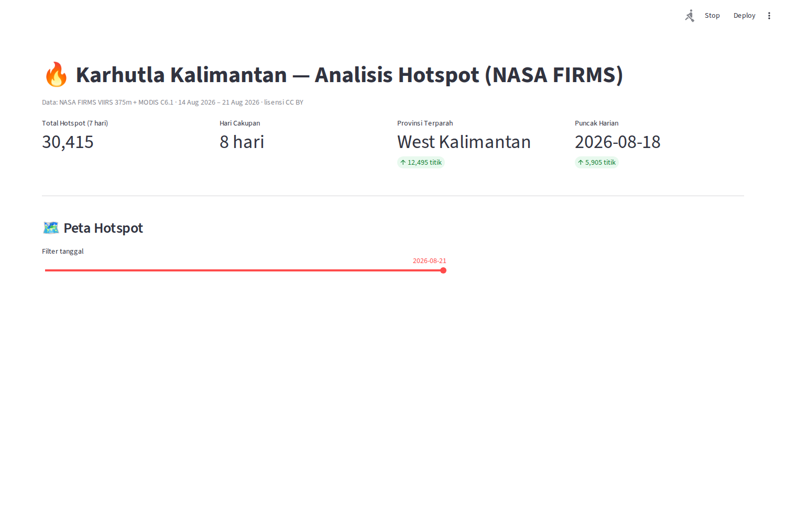

# 🔥 Karhutla Kalimantan — Wildfire Hotspot Analysis (NASA FIRMS)

> 📖 [English](README.md) · [Bahasa Indonesia](README.id.md)

End-to-end data analysis of **active fire detections in Kalimantan (Indonesian
Borneo)** from NASA's FIRMS (VIIRS 375m + MODIS C6.1), pulled **without an API key**
via the Humanitarian Data Exchange (HDX) mirror. Built as a data-analyst portfolio
project: real data, real storytelling, reproducible pipeline.

**Live data window:** 14–21 Aug 2026 · **30,415 hotspots detected** · Peak: 18 Aug
(5,905/day) · Worst province: West Kalimantan (41% of total)



## What's inside

```
kalimantan-karhutla/
├── src/
│   ├── extract.py    # pull FIRMS VIIRS+MODIS 7d CSVs (retry + backoff)
│   ├── transform.py  # bbox filter → point-in-polygon → province assignment
│   ├── analyze.py    # daily/province aggregates, FRP intensity bands
│   └── pipeline.py   # extract → transform → analyze, end to end
├── dashboard/
│   └── app.py        # Streamlit: interactive folium map + plotly charts
├── data/
│   ├── raw/          # original FIRMS CSVs (SE Asia)
│   ├── processed/    # cleaned Kalimantan hotspots + aggregates
│   └── boundaries/   # province boundaries (geoBoundaries ADM1, CC BY)
├── output/
│   ├── LAPORAN.md    # findings & recommendations (Bahasa Indonesia)
│   └── dashboard_*.png  # dashboard screenshots
└── scripts/screenshot.py  # headless dashboard capture (Playwright)
```

## Key findings (8-day window)

1. **West Kalimantan is the epicenter** — 12,495 hotspots (41.1%), followed by
   Central Kalimantan (10,555; 34.7%).
2. **Sharp surge 16→18 Aug** — daily count doubled to 5,905 and stayed high (5,500+)
   through Aug 21: a "fire outbreak" pattern, not a fading event.
3. **High-intensity fires present** — FRP up to **817 MW** in East/South Kalimantan;
   high-FRP points are the source of transboundary haze.

## How to run

```bash
python3 -m venv .venv && source .venv/bin/activate
pip install -r requirements.txt

# 1. Run the pipeline (downloads fresh 7-day data, ~30 MB)
python src/pipeline.py

# 2. Launch the dashboard
streamlit run dashboard/app.py
# open http://localhost:8501

# 3. (Optional) re-capture screenshots
python scripts/screenshot.py   # needs playwright + chromium
```

## Honest limitations

- **NRT data window**: FIRMS near-real-time covers ~7 days; the longer the project
  runs, the richer the seasonality story. A daily cron (`python src/pipeline.py`)
  accumulates history into `data/processed/`.
- **Hotspot ≠ burned area**: detections are thermal anomalies; VIIRS detects more
  points than MODIS due to finer resolution (375m vs 1km) — both are combined here
  for coverage, not double-counted for area.
- **FRP is a proxy** for fire intensity, not flame size.
- This is a portfolio/education project, **not** an official early-warning tool.

## Data sources & licenses

- **NASA FIRMS** active fire data (VIIRS S-NPP/NOAA-20/21 C2, MODIS C6.1) — public,
  via HDX mirror: `nasa-firms-active-fire-southeast-asia-viirs` / `-modis` (CC BY).
- **Province boundaries**: geoBoundaries `IDN_ADM1` (CC BY) via HDX.
- **ENSO context** (for seasonality studies): NOAA ONI index.
